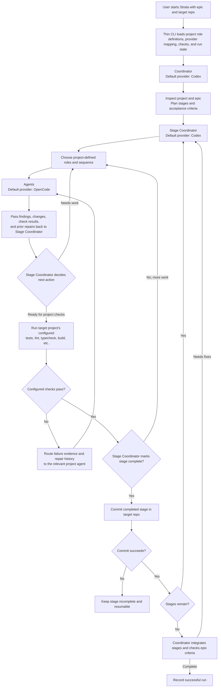

# Strata Run Flow

This diagram summarizes the workflow in [core.md](core.md). Coordinators and agent instructions are resolved from the target repository as described in [project-profile.md](project-profile.md).

## Workflow invariants
- Strata coordinates providers, context, state, configured project checks, and stage commits. It does not impose universal agent-quality gates or worker ordering.
- The Coordinator plans and integrates; a Stage Coordinator owns each stage; agents perform project-defined tasks.
- Project-defined role instructions and applicable automated checks are loaded from the target repository.
- Failed checks return to the Stage Coordinator with their output and prior repair history; the workflow continues through agent-directed repair until resolved or a concrete blocker is reported.
- Each completed stage is committed in the selected target repository. Failed checks or commits keep the stage incomplete and resumable.
- Provider choice is per role. Current defaults are Codex for coordinators and OpenCode for agents.
