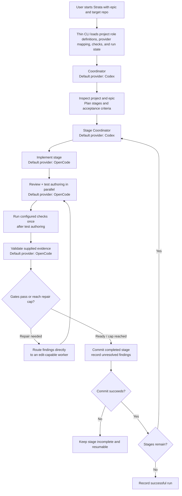

# Strata Run Flow

This diagram summarizes the workflow in [core.md](core.md). Coordinators and agent instructions are resolved from the target repository as described in [project-profile.md](project-profile.md).

## Workflow invariants
- Strata coordinates providers, context, state, configured project checks, bounded stage gates, and stage commits.
- The Coordinator plans; a Stage Coordinator prepares each stage handoff; agents perform project-defined tasks.
- Project-defined role instructions and applicable automated checks are loaded from the target repository.
- Review and test authoring run in parallel after implementation when their write scopes do not overlap; otherwise test authoring precedes review. Configured commands run once after authoring, then validation assesses the recorded evidence.
- Failed gates go directly to the relevant worker with findings and prior repair history. After a repair changes files, Strata reruns configured checks and affected review gates; exhausted limits are recorded as unresolved findings.
- Each completed stage is committed in the selected target repository. Commit failures keep the stage incomplete and resumable.
- Provider choice is per role. Current defaults are Codex for coordinators and OpenCode for agents.
