# Strata Run Flow

This diagram presents the workflow defined by [core.md](core.md), which is normative if any detail here is unclear.

```mermaid
flowchart TD
    U[User submits epic] --> CLI[CLI loads config and epic, detects repository state, initializes persistent run;<br/>save UTC timestamp-prefixed run records in docs/temps/]
    CLI --> EPIC[Level 1 Epic Coordinator<br/>Strong model]
    MEM[Load relevant active memory from configured store<br/>Advisory context only] --> EPIC
    EPIC --> PLAN[Inspect epic and repository<br/>Make architecture decisions<br/>Create stable, dependency-ordered stages and criteria]
    PLAN --> NEXT{Select next eligible stage}
    NEXT --> SC[Level 2 Stage Coordinator<br/>Fresh context for this stage]
    SC --> CTX[Provide stage contract, relevant specs and decisions,<br/>prior results, constraints, and relevant memory]
    CTX --> EXP[Explore repository with bounded read-only worker tasks]
    EXP --> TASKS[Stage Coordinator combines findings<br/>and plans scoped implementation work]
    TASKS --> IMPL[Implementer changes source within stage scope<br/>Returns structured result and changed paths]
    IMPL --> REVIEW[Independent read-only review<br/>Against stage, specs, rules, and diff]
    REVIEW --> RG{Review passes?}
    RG -->|No| REPAIR[Stage Coordinator analyzes evidence<br/>Assign scoped repair to the authorized role]
    RG -->|Yes| TEST[Tester owns executable verification<br/>Tests, typecheck, build, quality checks]
    TEST --> TG{Tester PASS with engine evidence?}
    TG -->|No| REPAIR
    TG -->|Yes| VALIDATE[Fresh-context Validator inspects final diff/code<br/>against Stage Contract and every criterion]
    VALIDATE --> VG{Validator PASS with evidence<br/>for every criterion?}
    VG -->|No| REPAIR
    VG -->|Yes| CHECKPOINT[Save stage-identifying Git checkpoint<br/>and structured phase results]
    CHECKPOINT --> CP{Checkpoint succeeds?}
    CP -->|No| HALT[Halt and preserve failure details<br/>and resumable state]
    CP -->|Yes| MORE{More stages remain?}
    MORE -->|Yes| NEXT
    MORE -->|No| FINAL[ Epic Coordinator performs final integration review<br/>Checks epic criteria, consistency, regressions, architecture]
    FINAL --> FV[Run final validation]
    FV --> FVG{Final validation passes?}
    FVG -->|No| FREPAIR[Targeted stage repair by authorized role<br/>Then repeat required stage gates and final validation]
    FREPAIR --> FLIMIT{Final repair budget remains?}
    FLIMIT -->|Yes, source change| IMPL
    FLIMIT -->|Yes, test-only change| TEST
    FLIMIT -->|No| HALT
    FVG -->|Yes| EPICCP[Save epic checkpoint and complete run result]
    EPICCP --> ARCH[Archivist captures observed, reusable memory<br/>once after successful run to configured store]
    ARCH --> DONE[Done]

    REPAIR --> LIMIT{Retry budget remains?}
    LIMIT -->|Yes, source change| IMPL
    LIMIT -->|Yes, test-only change| TEST
    LIMIT -->|No| HALT
    TEST -. unavailable required test .-> HALT
    VALIDATE -. unavailable required check .-> HALT
    ARCH -. archive failure recorded;<br/>run completion unchanged .-> DONE
```

## Workflow invariants

- A stage follows **implement → review → Tester verification → Validator → checkpoint**. Tester owns executable checks; Validator independently checks the final diff and code against every acceptance criterion.
- Phase and gate results are structured. Only executed engine evidence can pass a required gate; skipped or unavailable checks are not passing.
- Passing tests alone never establishes spec compliance. Failed review, Tester, or Validator results enter the existing scoped, bounded repair loop. Exhaustion, unavailable required evidence, or checkpoint failure halts execution and preserves resumable state.
- Stages have stable identities and run in dependency order. Resumption uses the original plan and checkpoint identities.
- Load relevant memory before planning and delegation. Memory is advisory, not gate evidence. Archive reusable knowledge only once after the whole run succeeds; archive failure does not change run completion.
- Shared mutations are serialized unless explicitly isolated. Provider-specific behavior belongs in adapters; workflow contracts remain provider-neutral.
